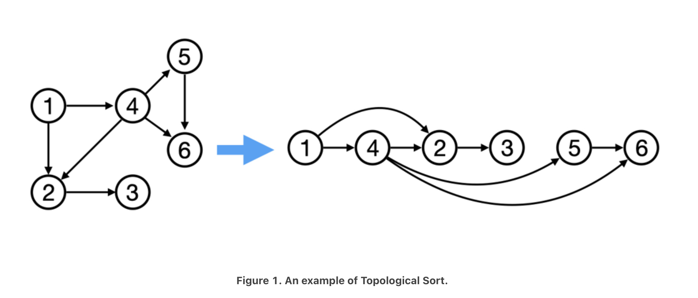

# Topological Sort (Kahn's Algorithm)

- Topological sort of a directed acyclic graph (a non-cyclic graph with unidirectional edges) is a linear ordering of its vertices such that for every directed edge (U,V) from vertex U to vertex V, U comes before V in the ordering. In other words, it is a graph traversal in which each node V is visited only after all its dependencies are visited.

- Given vertices U and V, to reach vertex V, we must first reach vertex U. In 'topological sorting', U has to appear before V in the ordering. The most popular algorithm for 'topological sorting' is **Kahn's algorithm**.

- For example, the vertices of a graph can represent tasks to be performed, and the edges can represent constraints where one task must be performed before another. In this case, a topological ordering is basically a valid sequence for the tasks.

- There can be more than one valid topological ordering of a graph.

## Limitations

- Topological sorting only works with graphs that are directed and acyclic (ie. directed acyclic graph (DAG)).
- There must be at least one vertex in the graph with an in-degree of 0.



## Fundamentals

- **Source** - Any node that has no incoming edge and has only outgoing edges.
- **Sink** - Any node that has **only** incoming edges and no outgoing edge.
- So, we can say that topological ordering starts with one of the sources and ends at one of the sinks.
- **Adjacency List** - A means of storing a graph such that each parent vertex will have a list containing a list of all its children vertices.
- **In-Degree** - The number of incoming edges pointing towards a vertex.
- **Out-Degree** - The number of outgoing edges pointing out of a vertex.

[Insert In-Degree and Out-Degree example]

## Intuition

- Traverse graph using BFS, which means we will use a queue.
- Loop list of edges (U,V), and store all sources, U, in a sorted list.
- Remove all sources and their edges from the graph After removing the edges, there will be new sources.
- Repeat process until all vertices are visited.

## Algorithm

### Step 1: Initialize an Adjacency List and In-Degree Count

- The graph is stored in an adjacency list, which means that each parent vertex has a list containing all of its children. In a hashmap, the key is the parent vertex number and the value is the array containing its children vertices.
- Create an array to count the **in-degrees** (ie. **count of incoming edges of each vertex**). Any vertex with '0' in-degree is a **source**. In other words, each index represents a vertex number, and the value represents the number of edges pointing to that vertex. If it helps, I also like to think of in-degrees as the number of dependencies a vertex has.
- To find all sources, use a **hashmap** to count the **in-degrees** (ie. count of incoming edges of each vertex). Any vertex with 0 in-degree is a **source**.

### Step 2: Store graph in adjacency list, and find In-degree of all vertices

- Build a graph from the provided array of edges, and populate the in-degree array.
- Loop array of edges, and store parent vertex as the key in the adjacency list, and its child vertex in an array of children vertices as the value.
- Increment the in-degree of each child vertex.

### Step 3: Find all sources and store in queue

- Loop in-degree array and store all vertices with 0 in-degree in a queue.

### Step 4: Sort the vertices

- Loop while the queue of sources is not empty.
- Shift from the queue and push source to the output array (ie. sorted list).
- Get all the source's children from the adjacency list, and loop the array of children.
- For each child, decrement the in-degree count.
- If the child's in-degree becomes 0, push child to the queue.

### Step 5: Make sure graph is acyclic

- Compare the length of the sorted list with the total number of vertices. If the lengths are not equal, then the graph contains a cycle.

## Solution - BFS

```js
import Deque from './collections/deque';

const topological_sort = function(vertices, edges) {
    // handle edge case
    if (vertices <= 0) return [];

    // create an adjacency list object and in-degree array
    const inDegrees = Array(vertices).fill(0),
            adjList = {};
    
    // store parent vertex as key in adjacency list, and its children as value.
    // increment in-degree of each child. The index of in-degree represents a vertex.
    edges.forEach((edge) => {
        const [parent, child] = edge;
        adjList[parent] ? adjList[parent].push(child) : adjList[parent] = [child];
        inDegrees[child]++;
    });
    
    // find and store all sources in queue
    const sourceDeque = new Deque;
    for (let i = 0; i < vertices; i++) {
        if (inDegrees[i] === 0) sourceDeque.push(i);
    }

    // sort vertices
    const sorted = [];
    let source;
    while (sourceDeque.length > 0) {
        source = sourceDeque.shift();
        sorted.push(source);
        if (adjList.hasOwnProperty(source)) {
        // get the node's children and decrement its in-degree.
        adjList[source].forEach((child) => {
            inDegrees[child]--;
            // if a child's in-degree is 0, then child is a source.
            if (inDegrees[child] === 0) sourceDeque.push(child);
        })
        }
    }

    // compare length to determine if graph is cyclic
    if (sorted.length !== vertices) return [];

    return sorted;
};

console.log(`Topological sort: ${topological_sort(4, [[3, 2], [3, 0], [2, 0], [2, 1]])}`)
console.log(`Topological sort: ${topological_sort(5, [[4, 2], [4, 3], [2, 0], [2, 1], [3, 1]])}`)
console.log(`Topological sort: ${topological_sort(7, [[6, 4], [6, 2], [5, 3], [5, 4], [3, 0], [3, 1], [3, 2], [4, 1]])}`)

// Expected Output (Note: there are multiple solutions to each sample test case):
Topological sort: 3,2,0,1
Topological sort: 4,2,3,0,1
Topological sort: 5,6,3,4,0,2,1
```

## Time Complexity

- O(V + E).
- Building the adjacency list takes O(E) time, since we must iterate over all edges. The adjacency list allows us to efficiently check which vertices depend on which vertices.
- Worst case is visiting every vertex with an in-degree of zero and decrementing the in-degree of every outgoing edge once will take O(V + E) time.
- Therefore, O(E) + O(V + E) = O(V + E).

## Space Complexity

- O(V + E).
- The adjacency list uses O(E) space.
- Storing the in-degree for each vertex takes O(V) space.
- The queue contains at most V nodes, so the queue takes O(V) space.

## Sources

[LeetCode Discuss - Introduction to Topological Sort](https://leetcode.com/discuss/general-discussion/1078072/introduction-to-topological-sort)
[Overview of Kahn's Algorithm](https://leetcode.com/explore/featured/card/graph/623/kahns-algorithm-for-topological-sorting/3886/)